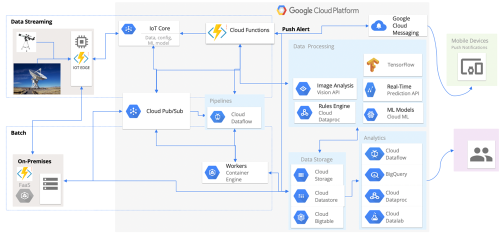
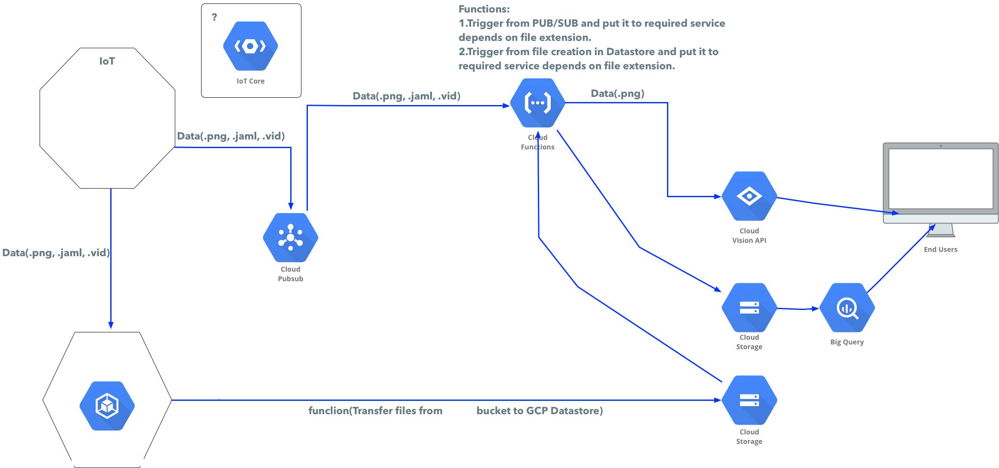

# DevOps_Challenge
By SoftServe Inc.
KV-049
***
# INTRODUCTION

This DevOps Challenge based on the Scientific Data Processing Solution Architecture and the project company is working on, which elicits the significant architecture drivers such as business, functional, non-functional requirements and constraints, defines the architecture and develops a roadmap for Scientific Data Processing Subsystem implementation. 
The document is intended as initial technical guidance into solution implementation for the development team.
The document is a short adopted version of the original material, because of NDA restrictions.

This document covers the following items, required for the DevOps Challenge:
- **Business Problem** 
- Significant **Architectural Drivers** for the Solution
- The proposed **Solution Architecture** based on these drivers
- **Technology stack** and environment definitions
- Operations specific perspectives
- **Project details**

***

# APPROACH AND METHODOLOGY
- A solutions architecture and implementation in a **Serverless Hybrid-Cloud** manner
- Continuous **DevOps** experience across hybrid solutions
- Automated **QA/QC** process setup and automation in **Micro-Services** environment
- Essential security (**DevSecOps**) for solutions, threat detection, visibility and control
- **Open Source** components customizations to fit Hybrid Cloud requirements (scientific tools in particular)

***

# IMPLEMENTATION PLAN
- **Grab all** the **Functional** **requirements** & **Non-Functional** requirements (like capacity, availability, security, ops, scale)
- **Decompose** Architecture
  - Define context
  - Align high-level Architecture with Cloud principles
  - Document Architecture decisions
  - Ops Model design
  - Components considering
  - Roadmap implementation
  - Define timeline, phases, milestones
  - Define deliverables
  - Define scope
  - Define inclusions and exclusions

***

# CHALLENGE SUMMARY
What exactly **we expect you to have** after passing the challenge:
- Expertise in designing Hybrid/Multicloud solutions
- Experience in building Microservices infrastructure 
- Design and develop CI/CD for  product lines
- Following advanced DevOps methodologies for product delivery
- Achieving the goal to provide the next-generation solution with speed and embed needed improvements and enhancements with the infrastructure provisioned and the code pushed in a DevOps fashion way.
- Achieving DevOps and Security = DevSecOps which is where security is embedded in an automated way with speed and scale.
- Building Highly available solution, based on cloud-native applications and according to platform agnostic approach
- Implementing Fault-tolerant architecture, based on active-active schemas for components deployed to central DC and secondary DC(s)
- Implementing microservices-based components utilizing all applicable orchestration capabilities and tools
- Providing agile and accurate CI/CD pipelines  
- Follow the Scalability, Auditability, and Deployability 
- Implement the components evolution  - fine-grained microservices and backend components, stateless and dockerised
- Implement Common Assurance system 
- Follow the Cloud-agnostic design.

***

# CASE
The Scientific Observatory gets all sorts of information:
- Weather Conditions
- Movement of celestial bodies
- Geological data
- Physical phenomena
All this information is analyzing with On-Premise resources and in the cloud automatically using pre-laid algorithms.
As a result of this analysis:
- Weather prediction
- Cataclysm prediction
- Search for minerals, water, life on other celestial bodies

### GOALS
- "Scientist" must work as a platform operator, able to work smoothly with all the algorithms and functions across the locations.
- Fast environment installation and setup is needed
- Build scientific data processing and data processing in general.
- Reduce scientific data processing time
- Deploy the data processing close to the data source and process data nearby.
- Achieve competitive advantage by using the Cloud-based PaaS and FaaS model
- Increase flexibility in integrating with 3d party services and cloud solutions
- Unify the data processing and ingestion from all 3d party channels 

### CONSTRAINS
- The scientific observatories are geo-distributed over the world 

### REQUIREMENTS
- There must be a command line interface for managing, troubleshooting, orchestrating, etc.
- Function workflows must be implemented
- Data entry resources must have secure connectivity to the function entry location.
- Online data store for data must be secure
- The system must handle 25000+ functions per day.   
- Scalability - Under high load, the system should be able to successfully scale up and down to handle occasional spikes in traffic. 
- Reliability
- Availability
- Disaster Recovery (Under any circumstance, in the event of a regional disaster in one of the datacenters hosting the application, there should be an automatic failover to a secondary region, with minimal service downtime )
- Capacity
- Throughput
- Security
- Confidentiality
- Auditing
- Maintainability
- Modifiability
- Testability

### RISKS
The Risks table uncovers potential high priority problems which can be expected to impact the assessed solution in major ways unless properly mitigated.

**Maintainability**: Due to the microservice approach there are a lot of separate function apps, which have a large degree of configuration setting duplication. A single configuration value has to be changed in all the places it appears for the application to function properly and respond to the configuration change

**Security**: API keys and secrets  placed in the configuration

**Scalability**:  Solution relies on DB’s, queues and object storages

***

# PROJECT PLAN

Typically, we propose the project to have two key phases of its lifecycle: **INITIAL Phase** and **ADVANCED Phase**.
The state while the solution stays in active prototyping mode is called the **INITIAL** Phase.

The goal is to implement all the prototypes and technical solutions to make the product ready to enter the ADVANCED Phase.

The team is responsible for performing the advancement and enhancement activities during the **ADVANCED** Phase.

A vital goal of **ADVANCED Phase** is to maintain the desired quality of service and implement more advanced technical solutions.

We propose you to start with understanding and implementing tactical architecture decisions, specific approaches, and technical prototyping.

Overall architecture and technical vision demonstrated in this document as a simplified Solution Architecture; your task is to build the solution according to the proposed scenario or enhance it and implement the more advanced solution. 

*** 

# PROPOSED ARCHITECTURAL DECISIONS
The chapter captures significant requirements driving the solution architecture. The requirements which are not influencing the solution architecture in substantial ways and irrelevant to the development as well as low level/priority requirement details and scenarios excluded from this section.
## DRIVERS
- Centralized transaction data storage and management on the cloud
- Seamless integration with 3rd party contributors (scientific organizations) and scientists
- Secure data access, transmission, and storage protected from the unauthorized access
- Configuration-driven data transformation workflow
- Service uptime ideally up to 99.9%
- Regional outages must not affect system availability
- Hybrid Cloud, Serverless, data ingestion pipeline
- Data Analysis (Scientific data, Telemetry)
- Full audit trail of all operations performed in the system (logging, tracing)

## CONCERNS
- All integration places in the application must be covered by log messages
- A secure connection between On-Premise and Cloud
- NoSQL nature of main databases
- Event brokers are used as an event transport
## QUALITY ATTRIBUTES 
- Response Latency - Under normal operation, the system should be able to process requests with less than 200ms response time.
- Scalability - Under high load, the system should be able to successfully scale up and down to handle occasional spikes in user traffic.
- Throughput - Under normal operation, the system should be able to handle 250 requests per second
- Availability - 99.99 SLA
- Disaster Recovery - Under any circumstance, in the event of a regional disaster in one of the datacenters hosting the application, there should be an automatic failover to a secondary region, with minimal service downtime
- Auditing - Under normal operation, an authenticated user attempts to operate the system. An audit trail of the user’s actions should be maintained with information, sufficient to trace modifications back to him
- Configurability - Under normal operation, a single configuration change to the system, affecting multiple subsystems, must take no more than 1 minute to implement, and must be applied in a single place

***

# SOLUTION ARCHITECTURE

The section Solution Architecture defines and reasons the architecture design based on the architecturally significant requirements and constraints identified in the section Architectural Drivers. 

1. The solution provides the Data Processing Pipeline for data on Hybrid Cloud via FaaS Platforms and  Cloud Platform services. 
2. These data will be taken automatically by scientific equipment, located all around the globe. 
3. The data taken by the equipment automatically picks up, and places to the distributed object storage. 
4. From there data triggers an event-driven data processing pipeline, which in turn, perform some steps including analysis, data processing as a part of the data ingestion process. 
5. After this process is done, an entry for this data processing result created in a distributed (ideally NoSQL) database. 
6. From there any further processing driven by Data Entry specialists, using the API, CLI, etc.

The next processing steps that the data processing system provide via its CLI interface are: 
- reading data metadata information
- reviewing labels 
- searching for some values 
- building graphs 

- All of these steps can be accomplished through the data processor solution’s CLI, simple UI an API.
- The data processor CLI will also offer the capability to view audit logs, view error information, and troubleshoot any issues.
- Users (scientists) will be able to log into the Data Processing System using credentials.
- The Data Processing System also have an IoT Edge part, which has and use the same functions as the Hybrid Cloud part of the platform.
- All of the Data Processing system’s functionality depends on the services provided by the data ingestion subsystem. Without the ability to reliably ingest data at scale, the Data Processing system will fail to meet its business goals.

***

#    Solution Description

The Solution is Hybrid by its nature; the Data Processing can be hosted on Hybrid Infrastructure, including GCP and AWS, and On-Premise Kubernetes based FaaS 
The choice to use FaaS Platform is good because its logic provides seamless integration with on-premises and any file systems and file storages. By using only Cloud PAAS and FAAS offerings the effort to integrate the Data Ingestion System will be reduced significantly. Also, the operational and management costs will be significantly lower due to the central management of FaaS functions.

The System is logically divided into distinct layers, achieving superior isolation and separation of concerns. The currently identified layers are UI (CLI and Web), Service, Domain, and Data. 

The **UI** Layer contains the modules that are responsible for the different capabilities of the Platform
The **Service** Layer of the application, including the Functions Triggers
The **Domain** Layer - contains all of the modules that encapsulate the domain logic of the platform
The **Data** Layer - contains all of the modules, responsible for storage in the system
Crosscutting **Logging** aspects.

* The Services layer exposes the data processing functionality via RESTful endpoints and gRPC.
* The part of the system responsible for Data Processing implemented following the event-driven architecture pattern. An event can be defined as a ‘significant change of state.’ In this case, this is the creation of a new data file at the edge or uploading it to the queue.
* User Interface module containing the web and CLI
* The Data Processing subsystem includes all of the needed functions and workflows
* The Logging Subsystem, which consists of the FaaS logging, and audit logging submodules.
* The Data Store subsystem, which contains the modules that encapsulate the system’s data storage
* The Imaging Subsystem, which includes all of the modules responsible for image processing, ingestion, storage
* Data Ingestion contains the modules responsible for the system’s data ingestion functionality
* Data Processing contains the modules responsible for the system’s image processing functionality
* Data Storage contains the modules responsible for the system’s image storage functionality 
* IoT Edge is the programmable edge, where we can run the functions
* FaaS - ideally, the K8S based FaaS Platform, where we run functions
* Workflow - the way, how we define functions chaining.

- All the functions must be session less, which means that they are horizontally scalable
- FaaS integration to enable the ability to migrate and define hybrid workloads across hybrid clouds.
- Functions must have auto-scaling enabled by default
- Cloud-Based pub/sub, On-Premise Kafka and MQTT to be used as an event bus
- On-Premise object storage and  Cloud Storage to be used 
- Cloud NoSQL and On-Premise NoSQL Databases to be used instead of On-Premise only
- The solution to leverage Cloud Functions and On-Premise Functions for the service layer
- The entire Data Layer Implementation replaced with object storage and big data lake instead of the NoSQL database only
- Functions to obtain the replaceability of the application’s components by relying on abstractions

### DATA PROCESSING SYSTEM
The Data Processing System is the pipeline-like cloud-native system that receives & caters to the REST requests and runs different data processing pipelines. Backend components proposed to be implemented with Python and Golang. User sessions handled by the token.

### QUEUEING & DATA BUS

Queuing is the cloud data pipeline which enables fast movement of data (raw data, telemetry, aggregated data & others) from IoT & Edge appliances belonging to various observatories into their respective On-Premises and to the Google Cloud Services. 
Technologies proposed to be applied: GCP, Apache BigData stack, Kafka, MQTT, Python, Scala, Golang, etc.

### FUNCTIONS PLATFORMS

Function as a Service Platforms provide the ability to deploy, run, and manage function workloads. It also provides the required tooling to integrate functions with ecosystem components (database, storage, triggers, etc.).

FaaS allowing developers to develop, run, and manage functions without the complexity of building and maintaining the infrastructure, typically associated with developing and launching an app.
FaaS brings the serverless capability to the on-prem cloud so that on-prem applications (micro-services, workloads, and others) can incorporate function architecture. 

### WORKFLOWS
To provide seamless Hybrid-cloud experience, workflow engine built to glue together multiple functions deployed across the hybrid infrastructure. This feature is called function chaining. Developers deploy their services and functions, define the workflow in a YAML file, and finally deploy them on the platform. The workflow engine exposes an endpoint, which is a serverless-style service.

***

# TASKS
## INITIAL PHASE
The overall idea of this period is to simplify the overall Original Solution, emphasize the parts of its vision and components as well as to demonstrate the core decisions and technologies. 
Transition Phase contains Hybrid infrastructure, based on PaaS Kubernetes, Programmable Edge, On-Premise Kubernetes and FaaS offerings such as Google Functions and On-Premise FaaS.

- Selected the most applicable use cases to start with
- Configurability implemented via shared configuration store, based on distributed object storage & integration with the chosen storage by implementing a simple configuration provider interface, and plugging it into the function app’s container and functions. 
- The Deployment is managed by the deployment Hybrid infrastructure provided by Google Cloud Platform and On-Premise Kubernetes
- Due to the Serverless nature of the solution, it relies on the underlying FaaS Platform for disaster recovery.
- Availability and Capacity Monitoring is done by using Cloud Platforms and Kubernetes capabilities.
  - Logging and Audit are realized using Cloud Platforms and internal CCP capabilities.
  - Performance Monitoring  done by using Cloud Platforms and internal CCP capabilities.
  - Health Monitoring is done by using Cloud Platforms and internal CCP capabilities.
- Gathering detailed Functional & Non-Functional Requirements of the program
- Simplifying Architecture Design to start with the Hybrid Cloud part:
  - Define context and align high-level New Architecture with use cases
  - Emphasize Architecture decisions
  - Ops Model design
  - Components simplifying (FaaS)
- Resources and storage capacity clarification and requesting
- Assumptions validation
- Development Schedule creation:
  - Define timeline, phases, milestones
  - Deliverables aligning
  - Define scope
  - Define inclusions and exclusions
- Deploy IoT Edge
  - MQTT
  - Gathering telemetry from IoT devices 
    - Example: Minor Planet Circulars (issued generally on a monthly basis
      - Case: Minor Planet Circulars Orbit Supplement (MPO) (issued up to thirteen times per year)
      - Case: Minor Planet Circulars Supplement (MPS) (issued three or four times a month)
      - Example: Minor Planet Electronic Circulars (MPECs) (issued as necessary, generally at least once per day)
  - Gathering video streaming from scientific equipment
  - Gathering photo streaming from scientific equipment
  - Implement Data publisher (The mechanism to write aggregated data to On-Premise)
- Use On-Premise Kubernetes (Docker for MacOS with Kubernetes)
  - Receiving data from IoT Edge
  - Establish Kafka authentication (certificate-based)
  - Processing data via FaaS (Serverless)
  - Data aggregation
  - Data Processing (Apache Flink, Apache Beam)
  - Pushing the data to GCPs
- Development of the Data Ingestion Logic and Workflows
- Development of the Data Processing functions
- Integrating the Data ingestion system into the existing solutions on Edge side
- Integrating the image ingestion system into the Data Processing system
- Support of the Image Processor on Data ingestion system

## ADVANCED PHASE
The overall idea of this phase is to proceed with improvements and follow all the business and architecture decisions. 

- Align private and Cloud Infrastructure with Cloud Security Policies, guidelines, and standards. 
- Design and implement a Disaster Recovery and Business Continuity strategy. 
- Replicate Platform components in Hybrid Cloud. 
- Geo-replicate all data storages to the secondary region. 
- Enable redundancy for REST services
- Design and implement retry strategies for calls to external services (GCP or AWS). If an external service is not working correctly, save the requests in persistent storage and suspend the workflow. Attempt to resume the workflow after a predefined period. Allow a finite number of retries before notifying an administrator
- Design and implement a data definition validation mechanism. Allow only valid data definitions when adding/updating/processing.
- Implement proper data isolation. Validate error content to prevent broadcasting sensitive data in error responses.
- Design and implement audit logging.
- Implement Environments and enhance CI/CD strategy.
  - Development environment which is automatically updated with the latest code from the develop branch. It is as close to a copy of the production environment as possible.
  - Continuous integration environment created every night, which executes all integration tests, calculates and collects code coverage and metrics, and then deletes the environment. This environment is as close to a copy of the production environment as possible.
  - The testing environment created each time a developer creates a test environment branch. The GIT push operation triggers a deployment mechanism, which creates a test environment in a separate resource group. The newly created environment is as close to a copy of the production environment as possible. When the testing is completed, the test environment branch is deleted. 
  - The staging environment is used to deploy code for final verification and UAT. It is as close to a copy of the production environment as possible. 
  - The production environment is based on Hybrid Infrastructure, aka Hybrid Cloud. The object storage is geo-replicated.
  - CI/CD pipelines 
  - CI jobs for functions
  - Automated Testing and code quality tools for code analysis
  - Configurations management 

***

# TEAM, ROLES, AND RESPONSIBILITIES
We expect you to form a team or work on the solution individually ( up to you, but we prefer the teamwork )
Please, separate responsibilities and concentrate on the next responsibility areas:
    Solution Design
    Hybrid Cloud 
    Serverless
    Security 
    Assurance
    Microservices
    Google Cloud, AWS
    Google Functions, AWS Lambda
    Google Cloud Storage, AWS S3
    Data Processing 
    Modeanalytics
    Kubernetes
    Serverless
    Code review   
    IoT 
    Owning solution Infrastructure
    CI/CD
    Data Lab

# APPENDIX: PROPOSED FRAMEWORKS:

Angular, React - for WebUI Components if you need to
**NodeJS**    - API, data processing, TensorFlow    
**GoLang**/**Python** - Scientific functions, Infrastructure, data processing, function workflows, functions, TensorFlow
**Kafka** - Queue
**Terraform** - Infrastructure    
**Docker** - Microservices, Functions    
**Kubernetes** - Containers orchestration tool responsible for components deployment, communication, scaling.

# APPENDIX: DEFINITIONS YOU NEED TO KNOW
The Definitions section lists the acronyms and terms used in this document which might possess lesser familiarity or double meaning to the reader.

- **PAAS** - Platform as a Service
- **FAAS** - Function as a Service
- **WBS**,Work Breakdown Structure – it is a deliverable-oriented breakdown of a project into smaller components.
- **Architectural Driver** is a requirement or other information item significantly affecting the architecture of the given solution.
- **QA**, A Quality Attribute is a property of a work product or goods by which some stakeholder or stakeholders will judge its quality. Quality attribute requirements such as those for performance, security, modifiability, reliability, and usability have a significant influence on the software architecture of a system.
- **QAS**, Quality Attribute Scenario - is an unambiguous and testable requirement for one or more System Quality Attributes such as Security, Performance, Availability, and others. The scenario includes measures to satisfy system non-functional requirements such as response time, number of supported users, etc.
- **QAW**, Quality Attribute Workshop is a collaborative process to collect and prioritize the non-functional requirements (architecture drivers) in the form of scenarios
- **Sensitivity** **Point** is an architectural decision involving one or more architectural components (and/or component relationships) that is critical for achieving a particular quality attribute response measure.
- The **Tradeoff** is an architectural decision that affects more than one attribute and is a sensitivity point for more than one attribute.
- The **Risk** is a potentially problematic architectural decision.
- **Nonrisk** is a right decision relying on assumptions that are frequently implicit in the architecture.
- **Multi-Tenant Architecture**, Software Multitenancy refers to a software architecture in which a single instance of software runs on a server and serves multiple tenants. A tenant is a group of users who share common access with specific privileges to the software instance.
- **Supportability** is the ability of the system to provide information helpful for identifying and resolving issues when it fails to work correctly.
- **Maintainability** is the ability of the system to change with a degree of ease. These changes could impact components, services, features, and interfaces when adding or changing the functionality, fixing errors, and meeting new business requirements.
- **Reliability** is the ability of a system to remain operational over time. Reliability is measured as the probability that a system will not fail to perform its intended functions over a specified time interval.
- **CDN**,Content delivery network or content distribution network (CDN) is a globally distributed network of proxy servers deployed in multiple data centers. The goal of a CDN is to serve content to end-users with high availability and high performance.
- **Availability** is concerned with system failure and its associated consequences. A system failure occurs when the system no longer delivers a service consistent with its specification. Such a failure is observable by the system's users-either humans or other systems.
- **Modifiability** is about the cost of change.
- **Performance** is about timing. Events (interrupts, messages, requests from users, or the passage of time) occur, and the system must respond to them
- **Security** is a measure of the system's ability to resist unauthorized usage while still providing its services to legitimate users.
- Software **Testability** refers to the ease with which software can be made to demonstrate its faults through (typically execution-based) testing. At least 40% of the cost of developing well-engineered systems is taken up by testing.

# APPENDIX: SERVERLESS
Serverless computing is a growing trend, and it is transforming the entire computing landscape. Function as a Service (FaaS) is a category of serverless computing, which enables event-driven execution of micro-workloads (i.e., functions) and removes the complexity of dealing with infrastructure (containers, VMs, and bare-metal) from the developers.
It offers efficient compute resource utilization and true pay-as-you-go model to the cloud consumers.

So far FaaS is mostly available through the public cloud — but enterprises are deploying on-premise cloud and container platforms to run their in-house applications. These platforms do not offer FaaS serverless computing, which is a big gap, as it is vitally needed for on-premise applications, as well. 

# APPENDIX: SECURITY RECOMMENDATIONS (OPTIONAL)
We recommend you creating an action plan to mitigate all the vulnerabilities related to:
- Minimize information returned in response during incorrect authentication
- Ensure that error messages only contain minimal details that are useful to the intended audience, and nobody else. The messages need to strike a balance between being too cryptic and not being cryptic enough. They should not necessarily reveal the methods that were used to determine the error. Such detailed information can be used to refine the original attack to increase the chances of success.
- If errors must be tracked in some detail, capture them in log messages - but consider what could occur if attackers can view the log messages.
- Avoid recording highly sensitive information such as passwords in any form. 
- Avoid inconsistent messaging that might accidentally tip off an attacker about an internal state, such as whether a username is valid or not.
- Implement Audit Logging for all operations that take place in the system.
- Implement a secure Key and Secret storage mechanism by integrating with Key Vault.  
- Instead of using secrets, the application can use its own identity to access the services that it is authorized to access with the permissions that are granted to it. 
- Implement automatic key rotation.